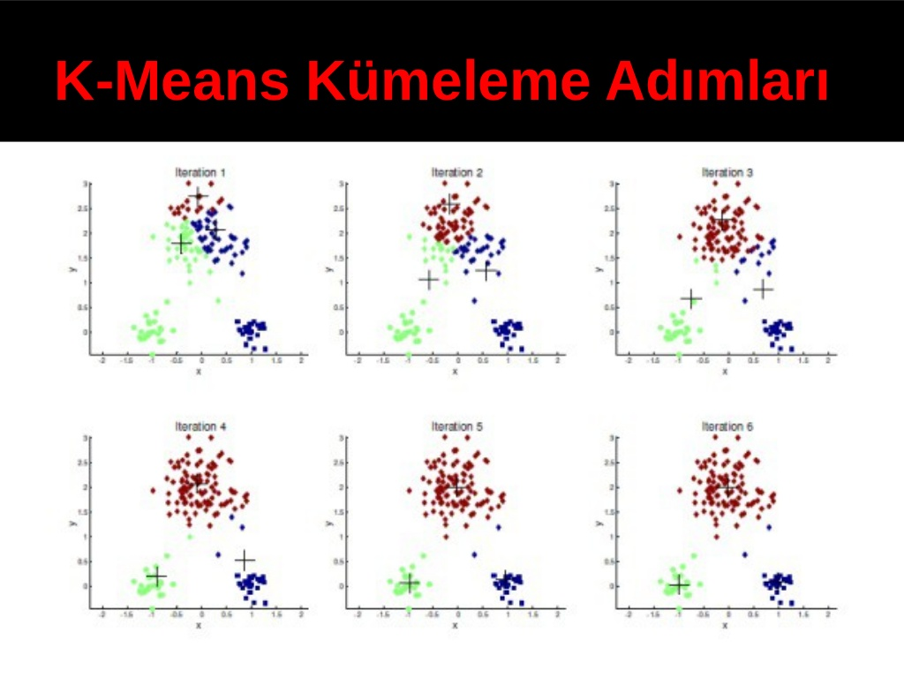

### K-Means Algoritması :dizzy:
- Verileri belirlenen küme sayısına göre, her küme için belirlenen ortalama değer doğrultusunda kümelenmesi üzerine çalışılır. K-Means algoritması eldeki verileri k adet kümede ve kümelerin ortalamalarına göre kümelere ayırır. K küme sayısı kullanıcı tarafından verilir.

- Kısaca <b>n tane nesneyi -küme içi benzerlik maksimum, kümeler arası benzerlik minimum olacak şekilde- k tane kümeye böler.

##### Avantajı:
- Uygulunabilirliği kolaydır ve büyük veri kümelerinde hızlı çalışabilir. Veri sayısı çok fazla olan hesaplamalarda, K-Means, küme sayısı küçük ise hesaplamaları, hiyerarşik kümelemeden daha hızlı yapar.

##### Dezavantajı:

- K-Means algoritması k küme sayısını tespit edememektedir. Bu nedenle uygun k sayısını bulana kadar bir deneme yanılma süreci gerçekleşmektedir.
- Gürültü verilere duyarlıdır. Bu veriler de kümelere dahil edilir.
